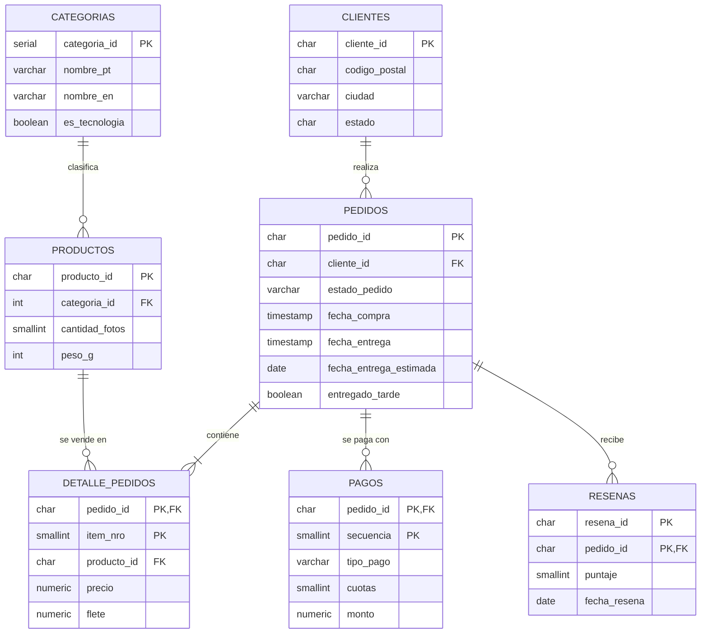
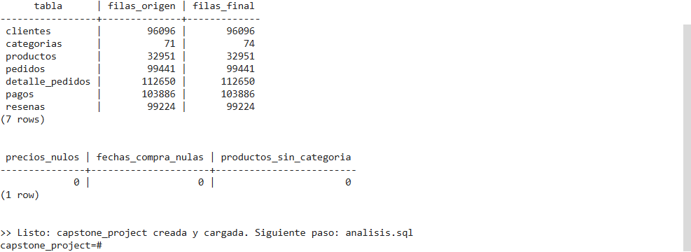
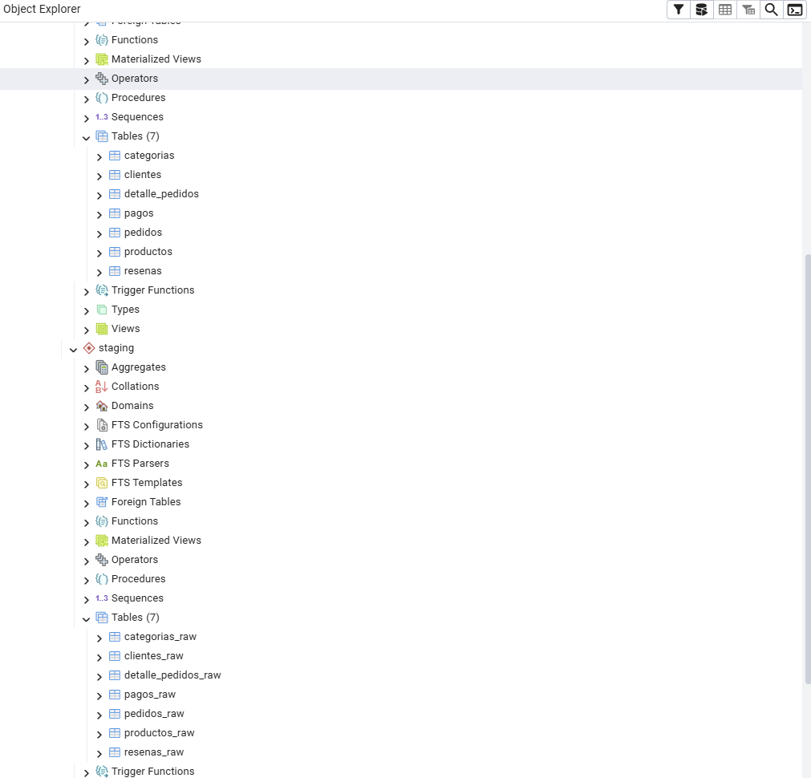
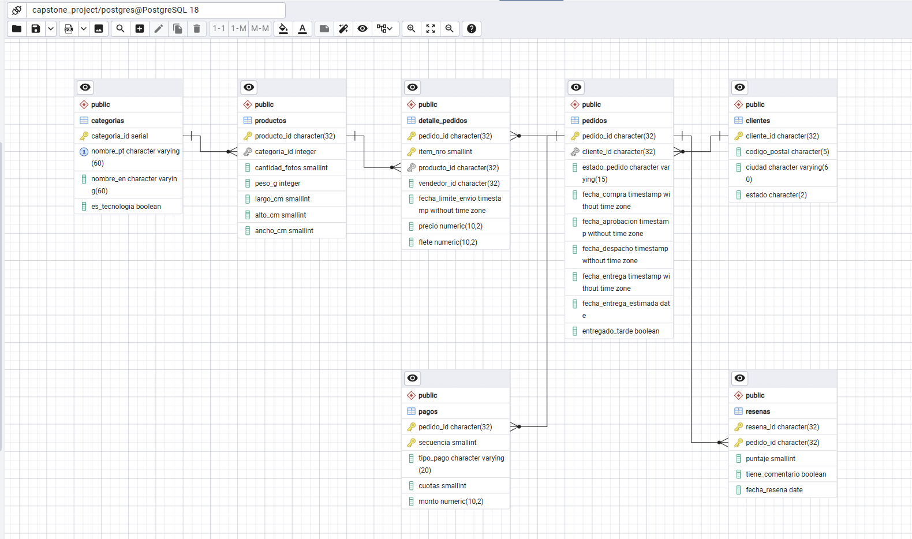
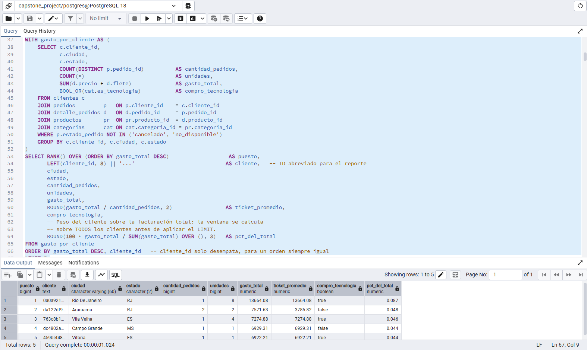
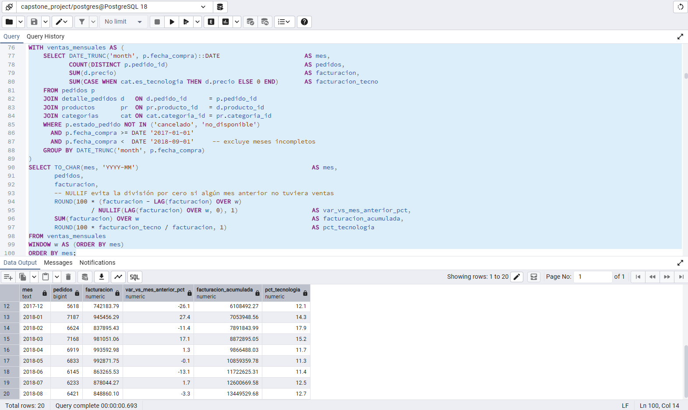
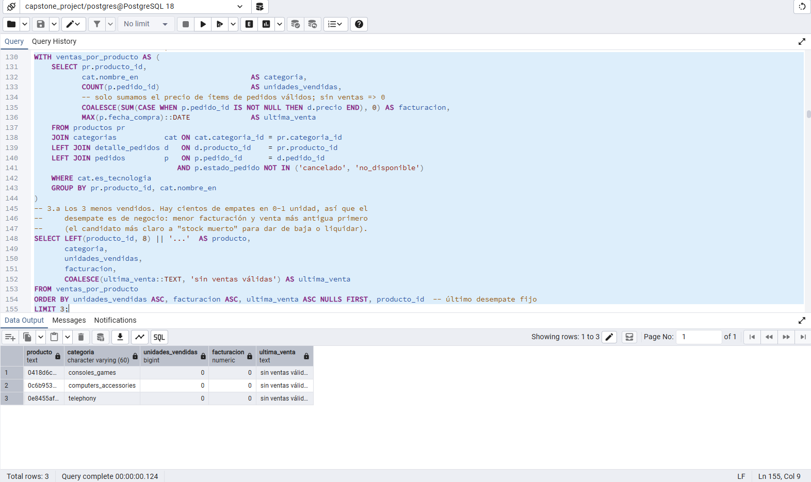
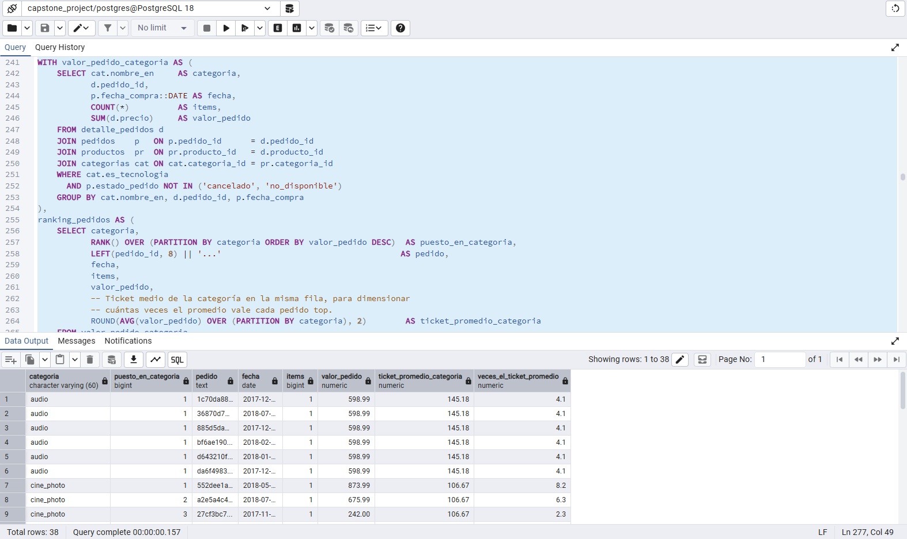
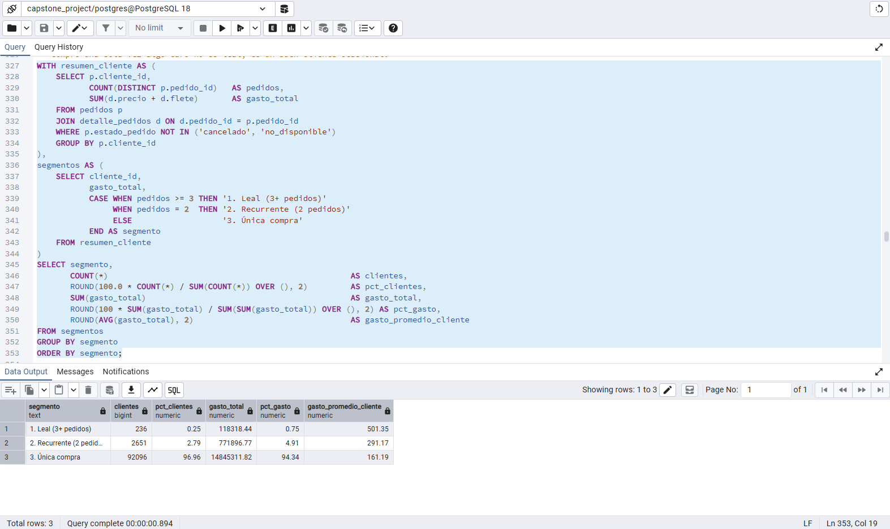
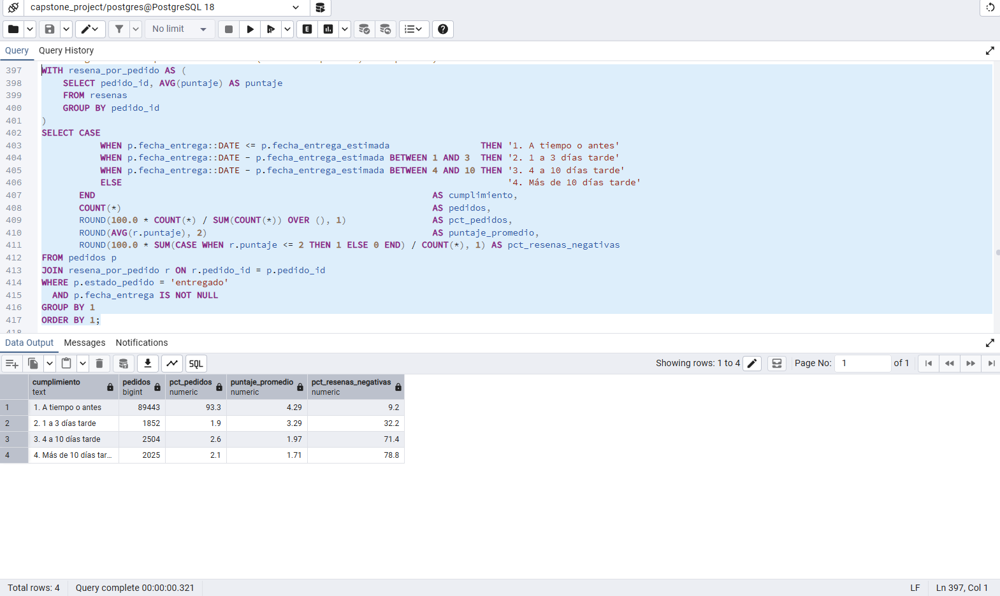

# Capstone SQL: ¿Conviene apostar por la vertical Tecnología en Olist?

**Análisis exploratorio de datos (EDA) en PostgreSQL** · Proyecto final del curso de SQL, Diplomatura en Data Science · Autor: Yonathan Malczewski

---

## Resumen ejecutivo

Analicé **98.199 pedidos válidos (R$ 13,5 millones facturados)** del marketplace brasileño Olist, entre 2017 y 2018, para evaluar si la dirección debería invertir más en la vertical **Tecnología**. Hallazgos principales:

1. **Tecnología representa el 14 % de la facturación y crece al mismo ritmo que el resto** (+133 % vs +139 % interanual). No es un motor de crecimiento propio: hoy acompaña al marketplace.
2. **En Olist, "Tecnología" significa sobre todo accesorios baratos.** Accesorios de informática y telefonía explican el 65 % de la vertical, con precios promedio de R$ 71 a R$ 116. Las computadoras valen R$ 1.098 por unidad, pero se vendieron apenas 203.
3. **El problema más grande del negocio es que los clientes no vuelven:** el 97 % compró una sola vez. Una buena primera experiencia casi no cambia esa tasa (3,1 % vs 2,9 %).
4. **La demora en la entrega destruye la satisfacción.** Un pedido que llega a tiempo tiene 4,3 estrellas de promedio. Uno que llega con 4 a 10 días de atraso, 2,0 estrellas, y el 71 % de sus reseñas son negativas. Río de Janeiro, el segundo mercado de Tecnología, tiene 3 veces más entregas tarde que São Paulo.
5. **El catálogo tecnológico tiene una "cola larga" enorme:** el 48,5 % de los productos vendió una sola unidad, mientras que 144 productos (3,7 %) concentran el 37 % de las unidades vendidas.

**Recomendación:** antes de sumar más productos, conviene (a) mejorar la logística en RJ y BA, (b) crear un circuito de recompra basado en accesorios y (c) probar un empuje de productos de alto valor (computadoras) con cuotas sin interés. El detalle está en la sección [Conclusiones](#7-conclusiones-y-recomendaciones-estratégicas).

---

## Contenido

1. [Contexto y problema de negocio](#1-contexto-y-problema-de-negocio)
2. [Dataset](#2-dataset)
3. [Estructura del repositorio](#3-estructura-del-repositorio)
4. [Modelo de datos](#4-modelo-de-datos)
5. [Limpieza y transformación](#5-limpieza-y-transformación)
6. [Hallazgos del análisis](#6-hallazgos-del-análisis)
7. [Conclusiones y recomendaciones estratégicas](#7-conclusiones-y-recomendaciones-estratégicas)
8. [Limitaciones](#8-limitaciones)
9. [Cómo ejecutar el proyecto](#9-cómo-ejecutar-el-proyecto)
10. [Técnicas SQL aplicadas y cumplimiento de la consigna](#10-técnicas-sql-aplicadas-y-cumplimiento-de-la-consigna)
11. [Evidencia de ejecución](#11-evidencia-de-ejecución)

---

## 1. Contexto y problema de negocio

Olist es un marketplace que conecta pequeños vendedores con los grandes canales de e-commerce de Brasil. La dirección está evaluando **invertir más en su vertical de Tecnología** (informática, telefonía, electrónica, gaming, audio y foto) y pidió un diagnóstico basado en datos antes de decidir.

Para eso, el análisis responde **8 preguntas de negocio**:

| # | Pregunta | Para qué sirve la respuesta |
|---|----------|-----------------------------|
| 1 | ¿Quiénes son nuestros 5 mejores clientes por gasto? | Medir si dependemos de pocos clientes grandes |
| 2 | ¿Cómo evolucionan las ventas mes a mes y cuánto aporta Tecnología? | Saber si la vertical crece más o menos que el negocio |
| 3 | ¿Cuáles son los productos de Tecnología menos vendidos? | Detectar stock que no rota |
| 4 | ¿Qué categorías lideran y cuáles son los pedidos más valiosos? | Entender qué es realmente "Tecnología" en Olist |
| 5 | ¿Cuándo compran los clientes y cuándo perdemos ventas? | Planificar campañas y detectar pérdidas |
| 6 | ¿Cuál es el perfil del cliente leal? ¿Vuelven los clientes? | Dimensionar el problema de retención |
| 7 | ¿Cómo impacta la demora en la entrega en la satisfacción? | Priorizar inversiones en logística |
| 8 | ¿Cómo pagan los clientes de Tecnología? | Evaluar las cuotas como palanca comercial |

---

## 2. Dataset

- **Fuente:** [Brazilian E-Commerce Public Dataset by Olist](https://www.kaggle.com/datasets/olistbr/brazilian-ecommerce) (Kaggle, licencia CC BY-NC-SA 4.0).
- **Contenido:** ~100.000 pedidos reales y anonimizados, realizados entre septiembre de 2016 y octubre de 2018.
- **Archivos usados:** 7 de los 9 CSV (se descartan `geolocation`, porque pesa 60 MB y no aporta a estas preguntas, y `sellers`).
- **Período analizado:** enero 2017 a agosto 2018 (20 meses completos). En 2016 hay solo 329 pedidos sueltos de la etapa de prueba de la plataforma, y septiembre/octubre de 2018 están incompletos. Incluirlos mostraría "caídas" que no son reales.
- **Moneda:** reales brasileños (R$).

---

## 3. Estructura del repositorio

```
capstone-sql-olist/
├── crear_bd.sql     # Setup automático: crea capstone_project (si no existe) y ejecuta estructura.sql
├── estructura.sql   # Creación de tablas, carga de CSV, diagnóstico, limpieza, índices y validación
├── analisis.sql     # 8 preguntas de negocio resueltas y comentadas + anexos técnicos (HAVING y EXPLAIN ANALYZE)
├── capturas/        # Evidencia de ejecución en pgAdmin (ver sección 11)
├── .gitignore       # Evita subir los CSV por error
└── README.md        # Este documento
```

> **Los CSV del dataset no se incluyen en el repositorio**, por tres motivos: (1) se pueden descargar siempre desde la fuente oficial en Kaggle, que es la referencia citable del dataset; (2) suman más de 100 MB, y GitHub no está pensado para versionar datos de ese tamaño; (3) el repositorio queda liviano y enfocado en el código y el análisis. Para reproducir el proyecto, ver [Cómo ejecutar](#9-cómo-ejecutar-el-proyecto).

---

## 4. Modelo de datos

La carga sigue un patrón **ELT** en dos capas:

- **`staging`:** tablas crudas con todas las columnas en `TEXT`, un espejo exacto de cada CSV. Así `COPY` nunca falla por una fila mal formada.
- **`public`:** el modelo final normalizado, con tipos correctos (`DATE`, `TIMESTAMP`, `NUMERIC(10,2)`, `SMALLINT`, `BOOLEAN`), claves primarias y foráneas y restricciones `CHECK`.



| Tabla | Filas | Descripción |
|-------|------:|-------------|
| `clientes` | 96.096 | Una fila por **persona** (ver hallazgo de limpieza #1) |
| `pedidos` | 99.441 | Cabecera del pedido, con fechas y estado |
| `detalle_pedidos` | 112.650 | Un ítem por fila, con precio y flete |
| `productos` | 32.951 | Catálogo |
| `categorias` | 74 | Categorías con traducción y marca de la vertical Tecnología |
| `pagos` | 103.886 | Medios de pago y cuotas (un pedido puede tener varios pagos) |
| `resenas` | 99.224 | Puntaje de 1 a 5 que deja el cliente |

---

## 5. Limpieza y transformación

Primero se **midió** la calidad del dato (sección 3 de `estructura.sql`) y después se tomó una **decisión explícita** por cada problema encontrado:

| # | Problema detectado | Decisión | Técnica |
|---|--------------------|----------|---------|
| 1 | **`customer_id` no identifica a la persona**: Olist genera uno nuevo por pedido (99.441 IDs para 96.096 personas reales) | La clave de `clientes` pasa a ser `customer_unique_id`. Sin este cambio, el Top de clientes y la tasa de recompra salen mal | `DISTINCT ON` + `JOIN` de mapeo |
| 2 | Una misma persona compró desde distintas direcciones | Se conserva la dirección del pedido más reciente | `DISTINCT ON … ORDER BY fecha DESC` |
| 3 | Los códigos postales son texto y cerca de 24.000 empiezan con 0 (`09790`). Si el CSV pasa por Excel, ese cero se pierde | Se garantizan 5 dígitos. Es una limpieza defensiva: con el CSV original de Kaggle no cambia ningún valor | `LPAD` |
| 4 | Ciudades en minúsculas y estados con posibles espacios | Formato uniforme | `INITCAP`, `UPPER`, `TRIM` |
| 5 | 610 productos sin categoría | Se asigna `sin_categoria`, para no perder esas ventas del total | `COALESCE` |
| 6 | 2 categorías sin traducción (`pc_gamer`, `portateis_cozinha…`) | Se usa el nombre original | `COALESCE` + `LEFT JOIN` |
| 7 | 610 productos sin cantidad de fotos | Se toma como 0 (sin fotos cargadas) | `COALESCE(…, 0)` |
| 8 | 4 productos con peso de 0 g | Se pasan a `NULL`: es un error de carga, y un 0 sesgaría los promedios | `NULLIF(…, 0)` |
| 9 | 2.965 pedidos sin fecha de entrega | **Se conservan como `NULL`** (no se imputan): significan "no entregado" o "cancelado" | Decisión documentada |
| 10 | 8 pedidos "entregados" sin fecha de entrega | `entregado_tarde = NULL`: no se puede medir su demora | `CASE` |
| 11 | Textos vacíos en el CSV (`''`) en vez de nulos | Se convierten a `NULL` antes de castear | `NULLIF(TRIM(x), '')` |
| 12 | Fechas y precios cargados como texto | Conversión a `TIMESTAMP`, `DATE` y `NUMERIC(10,2)` (nunca `FLOAT` para dinero) | `::TIMESTAMP`, `::DATE`, `::NUMERIC` |
| 13 | 3 pagos con tipo `not_defined` | Se normalizan a `no_definido` | `CASE` |
| 14 | 2 pagos con **0 cuotas** | Se corrigen a 1 cuota | `COALESCE(NULLIF(cuotas, 0), 1)` |
| 15 | `review_id` repetido entre pedidos y pedidos con más de una reseña | La PK es compuesta `(resena_id, pedido_id)`. En el análisis se promedia por pedido **antes** de unir, para no duplicar filas | PK compuesta + CTE |
| 16 | 775 pedidos sin ítems (casi todos cancelados o no disponibles) | Se documentan. Las consultas que parten de productos usan `LEFT JOIN` para no perderlos en silencio | `LEFT JOIN … IS NULL` |

**Controles de integridad:**

- Toda la transformación corre dentro de una transacción (`BEGIN … COMMIT`). Si algo falla, no queda la base a medio cargar.
- Las restricciones `CHECK` impiden valores imposibles: `precio > 0`, `puntaje BETWEEN 1 AND 5`, `cuotas >= 1`, entrega posterior a la compra.
- La validación final compara los conteos de filas de origen y destino (sin pérdidas ni duplicaciones) y confirma **0 nulos** en precio, fecha de compra y categoría.
- **Resultados reproducibles:** cada orden y cada "primer registro" (`ORDER BY`, `DISTINCT ON`, `ROW_NUMBER`, IDs `SERIAL`) tiene un desempate explícito. Así, volver a cargar los datos (aunque las filas de los CSV vengan en otro orden) o ejecutar en otra versión de PostgreSQL da exactamente los mismos resultados.
- Hay solo 5 índices, puestos en las columnas que el análisis usa en `JOIN` y `WHERE`. Indexar todo ralentiza la carga sin beneficio. El Anexo B de `analisis.sql` lo comprueba con `EXPLAIN ANALYZE`: buscar el historial de un cliente usa `idx_pedidos_cliente` (*Index Scan*, menos de 1 ms), mientras que un filtro por una columna sin índice recorre los 99.441 pedidos (*Seq Scan*).

---

## 6. Hallazgos del análisis

> **Convenciones:** *venta válida* es un pedido que no está `cancelado` ni `no_disponible`. *Facturación* es la suma de los precios de los ítems. *Gasto del cliente* es precio + flete.

### Pregunta 1: Top 5 clientes por gasto total

| Puesto | Cliente | Estado | Pedidos | Unidades | Gasto total (R$) | % del total |
|---:|---|:-:|:-:|:-:|---:|---:|
| 1 | 0a0a9211… | RJ | 1 | 8 | 13.664,08 | 0,087 % |
| 2 | da122df9… | RJ | 2 | 2 | 7.571,63 | 0,048 % |
| 3 | 763c8b1c… | ES | 1 | 4 | 7.274,88 | 0,046 % |
| 4 | dc4802a7… | MS | 1 | 1 | 6.929,31 | 0,044 % |
| 5 | 459bef48… | ES | 1 | 1 | 6.922,21 | 0,044 % |

**Interpretación:**

- **No hay dependencia de grandes clientes.** Los 5 mejores suman solo el **0,27 %** de la facturación. Perder a cualquiera de ellos no pone en riesgo el negocio.
- **Los mejores clientes no son clientes leales, son compras grandes aisladas.** 4 de los 5 compraron una sola vez.
- **Hay una señal de demanda B2B.** El cliente #1 compró **8 unidades del mismo tipo de producto** (telefonía fija) en un solo pedido, un patrón típico de una empresa o revendedor. 3 de los 5 compraron productos de Tecnología. Vale la pena explorar un canal para empresas con precios por volumen.

### Pregunta 2: Ventas mensuales y peso de Tecnología

| Indicador | Valor |
|---|---|
| Facturación total del período | R$ 13,45 M (ene-2017 a ago-2018) |
| Mejor mes | **Nov-2017: R$ 1,00 M (+52,1 % vs octubre)**, por el efecto Black Friday |
| Caída posterior | Dic-2017: −26,1 % |
| 2018 | Meseta entre R$ 0,84 M y R$ 0,99 M por mes, con leve baja desde mayo (jun: −13,1 %) |
| Crecimiento interanual ene-ago | Tecnología **+132,6 %**, resto **+139,2 %** |
| Participación de Tecnología | Entre 11 % y 21 % según el mes; pico en sep-2017 (20,6 %) y ~12 % a mediados de 2018 |

**Interpretación:**

- El marketplace **duplicó con creces** su facturación en un año. En 2018, sin embargo, el crecimiento se **frenó**: de febrero a agosto la facturación mensual se mantiene estable e incluso baja un poco.
- **Tecnología crece, pero algo menos que el resto, y pierde participación.** Tuvo su mejor momento relativo en ago-oct 2017 y en 2018 bajó a ~12 %. Hoy no es un motor de crecimiento propio.
- Noviembre muestra que **las fechas promocionales mueven el negocio** (+52 %). Tecnología, que es un rubro clásico de Black Friday, **perdió** participación ese mes (13,5 % vs 19,1 % en octubre). Es una oportunidad no aprovechada.

### Pregunta 3: Productos de Tecnología menos vendidos

Los 3 menos vendidos son productos de `consoles_games`, `computers_accessories` y `telephony` con **0 unidades válidas**: solo aparecen en pedidos cancelados o no disponibles. Como hay **25 productos empatados en 0 ventas** y 1.869 en una sola unidad, el ranking de los "3 peores" es arbitrario. Por eso se midió la distribución completa:

| Rotación | Productos | % del catálogo | % de unidades vendidas |
|---|---:|---:|---:|
| Sin ventas válidas | 25 | 0,6 % | 0 % |
| Una sola unidad | 1.869 | **48,5 %** | 10,9 % |
| Entre 2 y 5 | 1.297 | 33,7 % | 21,8 % |
| Entre 6 y 20 | 516 | 13,4 % | 29,9 % |
| Más de 20 | 144 | **3,7 %** | **37,4 %** |

**Interpretación:**

- El catálogo tecnológico sigue una **ley de Pareto extrema**. Casi la mitad de los productos vendió una sola unidad en 20 meses, y **144 productos "estrella" generan más de un tercio de las unidades**.
- Para la dirección, esto significa que **agregar más productos no es la palanca**. Lo que hay que asegurar es que esos 144 productos estrella nunca se queden sin stock: en el período hubo 609 pedidos *no disponibles*, ventas perdidas que en general reflejan falta de stock del vendedor.
- Los 25 productos sin ventas válidas son candidatos a revisión (publicación, precio o baja).

### Pregunta 4: Rankings con `RANK()`

**4.a** En el ranking general de categorías, `computers_accessories` es la **5.ª categoría del marketplace** (6,7 % de la facturación). `telephony` está 14.ª, con un ticket de apenas R$ 77 por pedido.

**4.b** Composición de la vertical Tecnología:

| Puesto | Categoría | Unidades | Precio promedio por unidad | % de Tecnología |
|---:|---|---:|---:|---:|
| 1 | computers_accessories | 7.781 | R$ 116 | 48,0 % |
| 2 | telephony | 4.527 | R$ 71 | 17,1 % |
| 3 | computers | 203 | **R$ 1.098** | 11,8 % |
| 4 | electronics | 2.755 | R$ 57 | 8,3 % |
| 5 | consoles_games | 1.127 | R$ 137 | 8,2 % |

**4.c** Top 3 pedidos por categoría (`RANK() OVER (PARTITION BY categoria)`): en `electronics` los pedidos top valen **40 veces el ticket promedio** (R$ 2.470 vs R$ 62), y en `telephony`, 31 veces. `RANK()` muestra empates reales. Por ejemplo, en `audio` seis pedidos comparten el puesto 1 con el mismo producto de R$ 598,99, lo que revela un producto "estrella" puntual.

**Interpretación:**

- **La vertical Tecnología de Olist es, en la práctica, una tienda de accesorios**: 2 de cada 3 reales vienen de accesorios de computación y de telefonía de bajo precio.
- **Computadoras** es la categoría de **mayor valor por unidad (R$ 1.098)** y aun con solo 203 unidades aporta el 11,8 % de la vertical. Es la categoría con más potencial si se logra escalar el volumen.
- Los pedidos que valen 30 a 40 veces el promedio confirman que existe demanda de alto valor, aunque hoy sea esporádica.

### Pregunta 5: Momento de compra y ventas perdidas

| Franja | % de pedidos | Tasa de pérdida |
|---|---:|---:|
| Madrugada (00-06 h) | 4,8 % | 1,31 % |
| Mañana (06-12 h) | 22,4 % | 1,28 % |
| **Tarde (12-18 h)** | **38,6 %** | 1,21 % |
| Noche (18-24 h) | 34,3 % | 1,10 % |

Por día de la semana, **el lunes concentra la mayor cantidad de pedidos (16,3 %)** y el volumen baja de forma sostenida hasta el sábado (10,9 %).

**Interpretación:**

- **La compra en Olist es de días hábiles y de tarde.** Más del 70 % de los pedidos se hace entre las 12 y las 24 h, y de lunes a miércoles se concentra casi la mitad de la semana. Las campañas pagas y los envíos de email rinden más si se programan **lunes y martes a la tarde**.
- **El horario NO explica las ventas perdidas.** La tasa de pérdida es casi igual en todas las franjas (1,1 % a 1,3 %). Las pérdidas vienen de causas operativas: la mitad son pedidos *no disponibles*, que en general reflejan falta de stock (ver pregunta 3). Cambiar horarios no las resuelve.

### Pregunta 6: Lealtad y recompra

| Segmento | Clientes | % de clientes | % del gasto | Gasto promedio |
|---|---:|---:|---:|---:|
| Leal (3+ pedidos) | 236 | 0,25 % | 0,75 % | R$ 501,35 |
| Recurrente (2 pedidos) | 2.651 | 2,79 % | 4,91 % | R$ 291,17 |
| Única compra | 92.096 | **96,96 %** | 94,34 % | R$ 161,19 |

| Primera experiencia (reseña del 1.er pedido) | Tasa de recompra |
|---|---:|
| Buena (4-5 estrellas) | 3,06 % |
| Neutra (3) | 3,06 % |
| Mala (1-2) | 2,88 % |

**Interpretación:**

- **Este es el hallazgo más importante del proyecto: Olist casi no retiene clientes.** 97 de cada 100 compran una sola vez.
- El perfil del cliente leal existe, pero es mínimo: 236 personas que gastan **3 veces más** que el cliente promedio. **Vale la pena multiplicar ese segmento.**
- **Que la primera experiencia sea buena no alcanza para que el cliente vuelva:** la recompra ronda el 3 % tanto con 5 estrellas como con 1. Una hipótesis posible: el cliente compra a través de marketplaces de terceros (así opera Olist) y no genera vínculo con la marca Olist. La retención tiene que construirse **activamente** (comunicación post-compra, beneficios y recomendaciones), porque no surge sola de un buen servicio.

### Pregunta 7: Logística y satisfacción

| Cumplimiento de la fecha prometida | % de pedidos | Puntaje promedio | % de reseñas negativas (1-2 ★) |
|---|---:|---:|---:|
| A tiempo o antes | 93,3 % | **4,29** | 9,2 % |
| 1 a 3 días tarde | 1,9 % | 3,29 | 32,2 % |
| 4 a 10 días tarde | 2,6 % | 1,97 | 71,4 % |
| Más de 10 días tarde | 2,1 % | **1,71** | **78,8 %** |

Estados con mayor facturación en Tecnología (top 5):

| Estado | Facturación Tecnología | Días de entrega promedio | Flete / precio | Entregas tarde |
|---|---:|---:|---:|---:|
| SP | R$ 665.119 | 9,0 | 13,1 % | 4,1 % |
| **RJ** | R$ 253.840 | **15,7** | 16,6 % | **13,0 %** |
| MG | R$ 215.045 | 12,3 | 16,7 % | 4,9 % |
| RS | R$ 102.851 | 15,1 | 19,2 % | 4,8 % |
| **BA** | R$ 92.566 | **18,4** | 16,6 % | **12,0 %** |

**Interpretación:**

- **La relación entre demora y satisfacción es directa y fuerte.** Con apenas 1 a 3 días de atraso, el puntaje cae un punto entero. Con más de 4 días, **7 de cada 10 clientes dejan una reseña negativa**, lo que en un marketplace afecta la reputación de todos los vendedores.
- **Río de Janeiro es el punto crítico de Tecnología.** Es el 2.º mercado de la vertical, pero tarda 75 % más que São Paulo (15,7 vs 9,0 días) y llega tarde **3 veces más seguido** (13 % vs 4 %). Bahía muestra el mismo patrón.
- **El flete pesa más lejos de São Paulo:** va del 13 % del precio en SP al 19-20 % en RS y PE. En productos baratos, como los accesorios, un flete alto puede frenar la compra.

### Pregunta 8: Medios de pago y cuotas

| Vertical | Monto promedio pagado | Tarjeta de crédito | Boleto | Cuotas promedio (tarjeta) | Pedidos en 6+ cuotas |
|---|---:|---:|---:|---:|---:|
| Tecnología | R$ 144,03 | 71,3 % | 24,0 % | **2,75** | **8,7 %** |
| Resto | R$ 163,27 | 76,2 % | 19,1 % | 3,69 | 17,5 % |

**Interpretación:**

- Contra lo que uno esperaría, **los pedidos de Tecnología se pagan en MENOS cuotas que el resto**. Esto confirma el hallazgo 4: como la vertical está dominada por accesorios baratos, la financiación casi no se usa.
- Tecnología tiene más uso de **boleto** (pago en efectivo o por transferencia bancaria): 24 % vs 19 %. Sugiere un comprador con menos acceso a tarjeta de crédito, o que compra montos chicos que no justifica financiar.
- **La financiación es una palanca sin explotar:** si se empujan productos de mayor valor (computadoras, consolas), ofrecer cuotas sin interés puede ser decisivo, como ocurre en otros rubros de Olist.

---

## 7. Conclusiones y recomendaciones estratégicas

**Respuesta a la pregunta de la dirección:** *¿conviene invertir más en Tecnología?* **Sí, pero no agregando más productos del mismo tipo.** Hoy la vertical es una tienda de accesorios de bajo precio que crece al ritmo del marketplace. La oportunidad está en resolver tres cuellos de botella que ya aparecen en los datos:

| Prioridad | Recomendación | Evidencia | Métrica para seguir |
|:-:|---|---|---|
| 1 | **Logística en RJ y BA para Tecnología:** revisar transportistas, sumar un centro de distribución o ajustar las fechas prometidas a la realidad | Con +4 días de atraso, el 71 % de las reseñas son negativas; RJ tiene 13 % de entregas tarde | % de entregas tarde por estado; puntaje promedio |
| 2 | **Programa de recompra basado en accesorios:** emails post-compra con accesorios complementarios (fundas, cargadores, periféricos) y un cupón para la segunda compra | 97 % de clientes con una sola compra; el cliente leal gasta 3 veces más | Tasa de recompra a 90 días (base actual: ~3 %) |
| 3 | **Empujar productos de alto valor con cuotas sin interés** (computadoras, consolas), probando primero con un piloto | Computadoras: R$ 1.098 por unidad y solo 203 unidades; Tecnología usa menos cuotas que el resto | Ticket promedio de Tecnología; % en 6+ cuotas |
| 4 | **Asegurar el stock de los 144 productos estrella** (la lista está en el Anexo A de `analisis.sql`) y revisar los 25 sin ventas | 3,7 % del catálogo = 37 % de las unidades; 609 pedidos *no disponibles* (ventas perdidas) | Pedidos *no disponibles* por mes |
| 5 | **Calendario comercial:** campañas de Tecnología en Black Friday y pautas los lunes y martes a la tarde | Nov-2017 +52 %, pero Tecnología perdió participación ese mes; el lunes es el día pico | % de Tecnología en noviembre |
| 6 | **Explorar un canal B2B** con precios por volumen | El cliente #1 compró 8 unidades del mismo producto en un solo pedido | Pedidos con 5+ unidades |

---

## 8. Limitaciones

- **Contexto:** los datos son de Brasil entre 2016 y 2018. Sirven como caso de estudio y no describen el mercado actual.
- **La definición de "Tecnología" es propia.** Se eligieron 10 categorías (ver `CASE` en `estructura.sql`, sección 4.1). Si se cambia esa lista, cambian los resultados de la vertical.
- **Olist es un marketplace**, no una tienda con stock propio. El stock y la logística dependen en parte de los vendedores.
- **Las reseñas son voluntarias** (99 % de los pedidos tiene una), así que pueden sobrerrepresentar experiencias extremas.
- **Facturación = precio de los ítems.** No descuenta vouchers ni devoluciones, porque el dataset no las registra.
- **Correlación no es causalidad:** la relación entre demora y puntaje es muy fuerte, pero para medir el impacto exacto de una mejora logística habría que hacer una prueba controlada.

---

## 9. Cómo ejecutar el proyecto

### Requisitos

- **PostgreSQL 18** (compatible con PostgreSQL 14 o superior)
- pgAdmin 4 (o DBeaver, o `psql`)
- Una cuenta en Kaggle para descargar el dataset

### Paso 1: Descargar el dataset y configurar la ruta

1. Descargá el dataset desde [Kaggle](https://www.kaggle.com/datasets/olistbr/brazilian-ecommerce) (botón *Download*) y **descomprimí los CSV en una carpeta fuera del repositorio**. La ruta recomendada es `C:/capstone_data/`.
2. Abrí `estructura.sql` y buscá, al inicio del archivo, la **única línea de configuración**:

   ```sql
   SET capstone.ruta_datos = 'C:/capstone_data/';
   ```

   - Si descomprimiste los CSV en `C:/capstone_data/`, **no hace falta cambiar nada**.
   - Si usaste otra carpeta, reemplazá solo el texto entre comillas por tu ruta. Acepta `/` o `\` y funciona con o sin barra final. Por ejemplo:

   | Sistema | Ejemplo de ruta |
   |---|---|
   | Windows | `C:/Users/<tu_usuario>/Documents/capstone_data/` |
   | macOS | `/Users/<tu_usuario>/capstone_data/` |
   | Linux | `/home/<tu_usuario>/capstone_data/` |

   El script arma la ruta de cada uno de los 7 CSV a partir de ese valor, así que no hay que tocar nada más.

> **¿Error `permission denied` al cargar los CSV?** El servicio de PostgreSQL no tiene permiso para leer esa carpeta, algo habitual en Windows cuando la carpeta está dentro de tu usuario. Usá `C:/capstone_data/` o dale permiso de lectura a *Todos* sobre la carpeta (clic derecho → *Propiedades* → *Seguridad* → *Editar* → *Agregar*).

### Paso 2: Crear y cargar la base (opción A: automática, recomendada)

`crear_bd.sql` arma todo el entorno **de una sola pasada**: crea `capstone_project` si no existe, se conecta a ella y ejecuta `estructura.sql` (carga, limpieza, índices y validación). Se puede ejecutar todas las veces que haga falta: si la base ya existe no falla, y siempre deja los datos en el mismo estado.

**Desde una terminal**, parado en la carpeta del repositorio:

```bash
psql -U postgres -f crear_bd.sql
```

> En Windows, si `psql` no se reconoce como comando, usá la ruta completa: `"C:\Program Files\PostgreSQL\18\bin\psql.exe" -U postgres -f crear_bd.sql`.

**Desde pgAdmin, sin terminal:** clic derecho en el servidor (*PostgreSQL 18*) → **PSQL Tool** y escribí, con la ruta de tu carpeta entre comillas simples y con `/`:

```
\i 'C:/ruta/a/capstone-sql-olist/crear_bd.sql'
```

Al terminar se ve `>> Listo: capstone_project creada y cargada` y la validación `0 | 0 | 0`. Ante cualquier error, el script se detiene en ese punto y muestra el mensaje.

### Paso 2 (opción B: manual con el Query Tool de pgAdmin)

1. Conectado a la base `postgres`, abrí el Query Tool y ejecutá `CREATE DATABASE capstone_project;`.
2. Clic derecho en `capstone_project` → *Query Tool* → abrí `estructura.sql` → **F5**. Tarda menos de 1 minuto y la última consulta devuelve `0 | 0 | 0`.

### Paso 3: Ejecutar el análisis

Abrí `analisis.sql` en un Query Tool sobre `capstone_project`. **Seleccioná una consulta por vez** (desde `WITH` o `SELECT` hasta el primer `;`) y presioná **F5**: pgAdmin muestra solo el resultado de la última sentencia ejecutada. Para obtener todos los resultados juntos en la terminal:

```bash
psql -U postgres -d capstone_project -f analisis.sql
```

*(Opcional)* Clic derecho en la base → **ERD For Database** para ver el diagrama entidad-relación.

---

## 10. Técnicas SQL aplicadas y cumplimiento de la consigna

| Requisito de la consigna | Dónde se cumple |
|---|---|
| Base `capstone_project` y tablas `clientes`, `pedidos`, `productos` | `crear_bd.sql` crea la base; `estructura.sql` sección 4 crea las tablas (más `detalle_pedidos`, `categorias`, `pagos`, `resenas`) |
| Entorno reproducible de una sola pasada | `crear_bd.sql`: un solo comando crea la base, carga, limpia y valida; re-ejecutable sin errores |
| Tipos correctos (`DATE`, `NUMERIC`) | `fecha_entrega_estimada DATE`, `precio NUMERIC(10,2)`, `fecha_compra TIMESTAMP` |
| Nulos en columnas críticas tratados con `COALESCE` | `estructura.sql` 4.1, 4.3, 4.5 y 4.6; `analisis.sql` P3 |
| Etapa de limpieza evidenciada antes del análisis | `estructura.sql` sección 3 (diagnóstico), sección 4 (limpieza) y sección 6 (validación) |
| JOINs de al menos dos tablas | Todas las preguntas; hasta 5 tablas en P1 |
| Top 5 clientes (`GROUP BY` + `SUM`) | P1 |
| Ventas por mes (funciones de fecha) | P2: `DATE_TRUNC`, `TO_CHAR`, `EXTRACT` |
| 3 productos menos vendidos | P3 |
| Ranking con `RANK()` | P1, P4 (a, b, c) y P7b |
| Window functions adicionales | `LAG`, `SUM() OVER`, `AVG() OVER`, `ROW_NUMBER`, `COUNT() OVER` |
| `CASE` | Segmentación (P6), franjas horarias (P5), tramos de demora (P7), vertical (P2, P8) |
| CTE (`WITH`) | P1, P2, P3, P4, P6, P7 y P8 |
| Manejo de errores | Transacción `BEGIN/COMMIT`, `CHECK`, `NULLIF` contra división por cero, `ON_ERROR_STOP` (el setup se detiene ante el primer error), scripts re-ejecutables (`DROP … IF EXISTS`, creación condicional de la base) |
| `HAVING` (filtro de grupos vs `WHERE`) | Anexo A de `analisis.sql`: lista de los 144 productos estrella de Tecnología (`HAVING COUNT(*) > 20`) |
| Optimización con `EXPLAIN ANALYZE` | Anexo B de `analisis.sql`: *Index Scan* sobre `idx_pedidos_cliente` vs *Seq Scan* en una columna sin índice |
| Eficiencia | CTEs en lugar de subconsultas anidadas; agregación antes del JOIN para evitar la explosión de filas; índices solo en columnas de JOIN y WHERE |
| Evidencia de que los scripts son ejecutables | Sección 11: capturas del setup, del modelo y de los resultados en pgAdmin (PostgreSQL 18) |

---

## 11. Evidencia de ejecución

Capturas tomadas en **pgAdmin 4 con PostgreSQL 18**, ejecutando los scripts de este repositorio sobre el dataset completo.

### Setup y modelo de datos

**Setup automático** (`crear_bd.sql` en la PSQL Tool): la base se crea, se carga y la validación final devuelve `0 | 0 | 0`.



**Tablas creadas:** 7 tablas finales en `public` y 7 tablas crudas en `staging`.



**Diagrama entidad-relación** generado por pgAdmin a partir de las claves primarias y foráneas.



### Resultados de las consultas requeridas por la consigna

**P1: Top 5 clientes por gasto total**



**P2.a: Ventas mensuales**



**P3.a: 3 productos de Tecnología menos vendidos**



**P4.c: Ranking de pedidos por categoría con `RANK()`**



### Resultados de los hallazgos principales

**P6.a: Segmentos de clientes (lealtad)**



**P7.a: Demora en la entrega y satisfacción**



---

*Proyecto desarrollado como entrega final (Capstone) del curso de SQL con PostgreSQL, Diplomatura en Data Science.*
